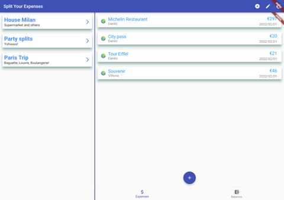

# Split Your Expenses

This is a multiplatform application to automatically split the expenses between friends. The application is developed using the Flutter framework and can run both on iOS and Android devices. It supports smartphones and tablets with different layouts.  

**Add the expense and choose which of your friends will share it.**

The idea of this application comes from the possibility to have a facility that would help us in the common life of university roommates that have to split some of the expenses for the house they share. For Instance, you have to go to the supermarket to buy some products for house cleaning and you want to divide the expense’s amount with some of your housemates, but suddenly you realize that one of them lend you some money the day before, in this case we are in front of a give-have cycle that could be difficult to manage. 

This application was built for the "Design and Implementation of Mobile Application" course of Politecnico di Milano.


## How to run the application

* Install Flutter  
https://docs.flutter.dev/get-started/install

* Create a Firebase account

* Add Firebase to the Flutter application
https://firebase.google.com/docs/flutter/setup?platform=ios

* Run the Flutter application  
You can press the run button on your favorite IDE  
OR  
Type the following command in the terminal
```
flutter run
```

## Screens

<p float="left">
  
  
  
  
</p>
<p float="left">
  
  
  
  
</p>

The application also support **tablets** and **landscape mode** on smartphones.

<p float="left">


</p>
